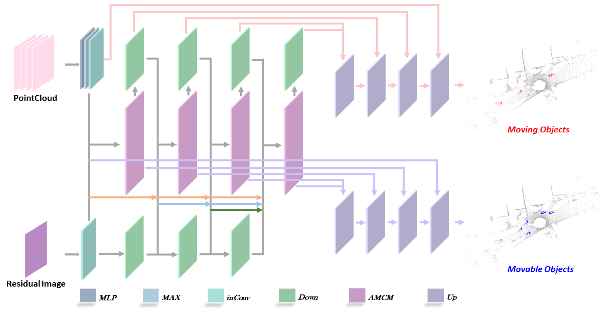

# MotionBEV++: A Moving Object Semantic Segmentation Model Based on the Bird's eye view

<div align="center">
<p>
         
</p>
</div>


## Developing From [MotionBEV](https://github.com/xieKKKi/MotionBEV)
Thanks for [xiekkki](https://github.com/xieKKKi)'s wonderful job!

## Prerequisites
Take a reference of [MotionBEV](https://github.com/xieKKKi/MotionBEV)

my environment: 

- Ubuntu:18.04 CUDA:11.6 CUDNN:8.3 python:3.9
- torch==1.13.1+cu116 torch-scatter==2.1.1
- dropblock==0.3.0 tqdm==4.66.1 numpy==1.21.6

(how to install pytorch : take a reference in [pytorch.org](https://pytorch.org/get-started/previous-versions/))

ensure that **open3d** = 0.15.2, if you want to visualize the pointcloud
```shell
conda create -n mosbev python=3.9
```
## DATA
Take a reference of [MotionBEV](https://github.com/xieKKKi/MotionBEV)

Only need to prepare SemanticKITTI （KITTI-road if you want to use)


## How to use it
### Generate the residual image
- modify **scan_folder** and **residual_image_folder** in the [data_preparing_polar_sequential.yaml](utils/generate_residual/utils/data_preparing_polar_sequential.yaml)

    scan_folder : the path to kittidataset

    residual_image_folder : the output path

- then run 
```shell
python utils/generate_residual/utils/auto_gen_polar_sequential_residual_images-mp.py
```


### Infer
there are two pretrained models:

[MotionBEVpp-valid-77.58.pt](pretrained/MotionBEVpp-valid-77.58.pt)

[MotionBEVpp-test-77.88.pt](pretrained/MotionBEVpp-test-77.88.pt)
- modify **data_path**, **data_path_test**, **residual_path** and **model_load_path** in the [infer.yaml](config/infer.yaml)

    data_path : the path to kittidataset

    data_path_test : the path to the test part of kittidataset

    residual_path : the path to the residual image path

    model_load_path : the pretrained model path

- also if you want to infer in the test part, change the parameter of **test** to **True** in [infer.yaml](config/infer.yaml)
- then run
```shell
python infer.py
```

### Train
- modify **data_path** and **residual_path** in the [MotionBEVpp-semantickitti.yaml](config/MotionBEVpp-semantickitti.yaml)

    data_path and residual_path are the same meaning as before
- then run
```shell
python train.py
```

### Evaluate
- run
```shell
python utils/evaluate.py -l $your_dataset_path -s 'valid'
```

### Visualize
- modify **seq**, **dataset_path**, **gt_label_path** and **prediction_label_path** in the [viz.sh](open3d-semantickitti-mos-visualize/viz.sh)

    seq : sequence

    dataset_path : the path to dataset velodyne

    gt_label_path : the path to dataset groundtrue label

    prediction_label_path : the path to the prediction 

- then run
```shell
cd open3d-semantickitti-mos-visualize
bash viz.sh
```
Press key  `d`  to show next frame.

Press key  `a`  to show last frame.

Press key  `z`  to auto play.

Press key  `x`  to stop auto play.

Press key  `s`  to save the view.

Press key  `f`  and input number to the frame you want.

Press key  `p`  to get the screen capture.